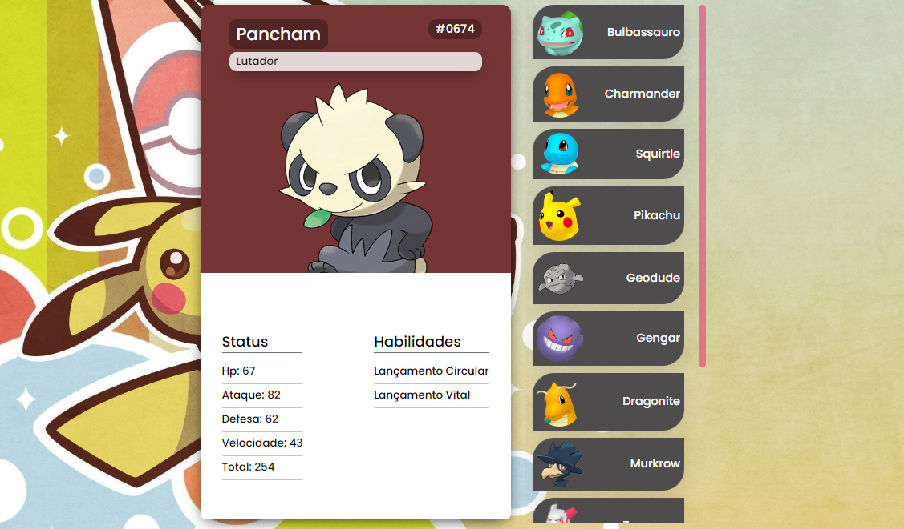

# Pokedex Web
Decidi refazer este projeto antigo (https://github.com/Farrush/PokedexJs) usando VueJs e banco de dados 
sqlite3 que é acessado por meio de uma api feita com Node e Express.

## Instale os pacotes
```
npm i
```
## Comando para rodar o projeto
```
npm run dev
```
porta: 8080

## Comando para rodar a api 
```
npm run server
```
porta:3000

<br/>



